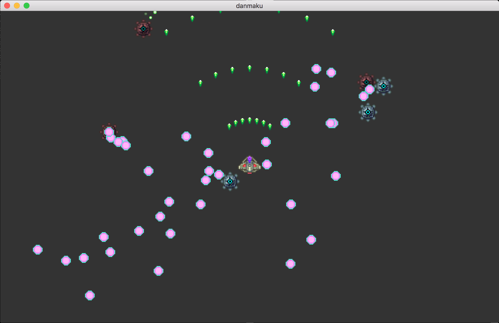
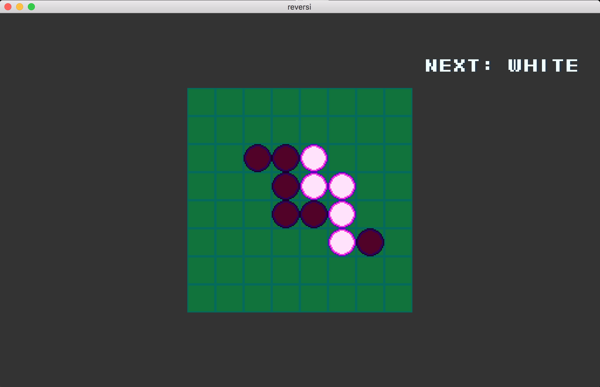
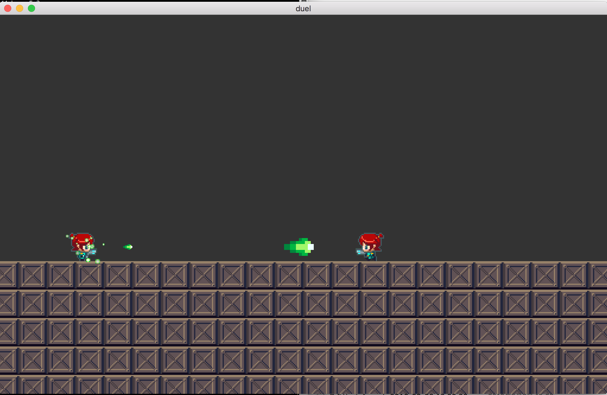

# moyai_samples

MoyaiのRemoteHeadを用いたサンプルゲームです。

## ソースコードの初期化

1. git clone moyai_sample
2. cd moyai_sample
3. git submodule update --init moyai

## サンプルゲームのビルド

1. moyai_sample/moyaiをビルドする(Moyaiのビルド手順に従う)
2. moyai_sample/Makefile で make する。  dm, rv, duelの3つが生成される。

## サンプルゲームの内容・操作

- dm : 弾幕シューティングゲーム

W,A,S,Dキーを使って自機を操作し、スペースキーを使ってビームを撃ち、敵キャラクターを破壊します。
このサンプルは、自機の弾・敵の弾を含めて、とにかく大量の、
500〜1000個程度のスプライトが画面上を動き回るようになっています。
大量のスプライトが動いている状態でどの程度通信帯域を消費するのかを実際に検証することができます。

- rv : リバーシ

マウスを使って、リバーシをプレイすることができます。
NEXT: WHITEと表示されているときにクリックすると白が置かれ、NEXT:BLACKと表示されているときは黒が置かれます。
すでにピースが置かれているところをクリックすると、反転します。
自動的に反転させたり、勝敗を判定したりする機能はありません。

このサンプルは、ほとんどのときに画面が静止しているようなゲームにおいて、
通信帯域の消費をどれだけ小さくできるかを検証することができます。

- duel : 対戦格闘

A,Dキーを使って左右に移動し、Wキーを使ってジャンプします。
スペースキーを押し下げているあいだはエネルギーをチャージし、
スペースキーを離すと、溜めたエネルギーを弾として発射します。
大きいエネルギー弾を相手に当てるほど強く跳ね飛ばすことができ、
場外に押し出せば勝利です。
また、体当たりして押すこともできます。

このサンプルによって、対戦格闘ゲームのような遅延を嫌う内容のゲームを、
リモートレンダリング方式のうえで、どの程度満足にプレイできるかを検証することができます。

## サンプルゲームのコード

sample_common.cpp と sample_common.h　が、各サンプルの共通部分を抜き出したファイルです。
弾幕サンプルゲームは "danmaku.cpp"を、 リバーシは"reversi.cpp"を、
対戦格闘は "duel.cpp" をこの sample_common.cppとともにコンパイルしています。

